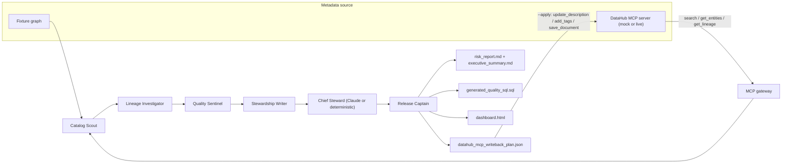

# Architecture

## Runtime

The runtime is intentionally dependency-light (standard library only):

- `fixtures.py` loads a DataHub-shaped JSON graph.
- `models.py` defines assets, schema fields, assertions, lineage, findings, proposals, team cards, and the run (engine + narrative).
- `agents.py` implements the five deterministic worker agents.
- `reasoning.py` is the Chief Steward pass: it turns grounded findings into an executive brief and prioritized plan, using Claude when available and a deterministic template otherwise.
- `llm.py` is a zero-dependency Anthropic client (urllib, with an optional SDK fast-path).
- `orchestrator.py` runs the worker team, ranks findings (critical first), then applies reasoning.
- `render.py` writes judge-friendly artifacts, including the dark-mode dashboard.
- `mcp_server.py` / `mcp_client.py` / `gateway.py` implement a real MCP JSON-RPC loop.
- `cli.py` exposes `inspect-fixture`, `run`, and `mcp-demo`.

## Grounded findings, agentic reasoning

The worker agents are deterministic on purpose: findings are **facts** derived from the DataHub graph (URNs, assertions, lineage, PII heuristics), so they are reproducible and trustworthy. The Chief Steward layer is where the project is genuinely agentic — a Claude model reasons over those facts to prioritize and narrate. Because the model only ever sees detected findings, it cannot invent risks that are not in the graph. Without a key, a deterministic template produces the same brief structure, so the demo never breaks.

## The MCP loop

`mcp-demo` proves the live path with no credentials:

1. `mcp_client.py` launches `mcp_server.py` as a subprocess and performs the MCP `initialize` handshake over newline-delimited JSON-RPC 2.0 on stdio.
2. `gateway.py` reconstructs a `DataHubGraph` purely from **read** tools (`search` → `get_entities` → `get_lineage`) — exactly how a live integration would.
3. The squad analyzes the reconstructed graph.
4. With `--apply`, approved proposals are executed through **mutation** tools (`update_description`, `add_tags`, `add_terms`, `save_document`), then the affected entities are re-read to show verified before/after diffs.

## Live DataHub Extension

The mock server speaks the same tool names as the official DataHub MCP Server. To go live, point `MCPStdioClient` at `uvx mcp-server-datahub@latest` (see `mcp/datahub-mcp.local.json`) instead of the bundled mock — the gateway, agents, reasoning, and writeback logic are unchanged.

