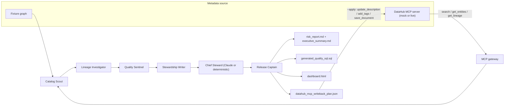

# Architecture

## Runtime

The runtime is intentionally dependency-light (standard library only):

- `fixtures.py` loads a DataHub-shaped JSON graph.
- `models.py` defines assets, schema fields, assertions, lineage, findings, proposals, team cards, and the run (engine + narrative).
- `agents.py` implements the five deterministic worker agents.
- `reasoning.py` is the Chief Steward pass: it turns grounded findings into an executive brief and prioritized plan, using Claude when available and a deterministic template otherwise.
- `llm.py` is a zero-dependency Anthropic client (urllib, with an optional SDK fast-path).
- `orchestrator.py` runs the worker team, ranks findings (critical first), then applies reasoning.
- `render.py` writes judge-friendly artifacts, including the dark-mode dashboard.
- `mcp_client.py` / `gateway.py` implement a real MCP JSON-RPC loop.
- `mcp_server.py` is the bundled DataHub-shaped mock server (offline fallback).
- `live.py` is the live backend: it launches the official `mcp-server-datahub`
  and adapts its GraphQL-shaped responses into the model (`LiveDataHubMCPGateway`).
- `cli.py` exposes `inspect-fixture`, `run`, and `mcp-demo` (with `--live`).

## Grounded findings, agentic reasoning

The worker agents are deterministic on purpose: findings are **facts** derived from the DataHub graph (URNs, assertions, lineage, PII heuristics), so they are reproducible and trustworthy. The Chief Steward layer is where the project is genuinely agentic — a Claude model reasons over those facts to prioritize and narrate. Because the model only ever sees detected findings, it cannot invent risks that are not in the graph. Without a key, a deterministic template produces the same brief structure, so the demo never breaks.

## The MCP loop

Both `mcp-demo` (mock) and `mcp-demo --live` (real DataHub) run the same loop:

1. `mcp_client.py` launches the MCP server as a subprocess and performs the MCP `initialize` handshake over newline-delimited JSON-RPC 2.0 on stdio.
2. The gateway reconstructs a `DataHubGraph` purely from **read** tools (`search` → `get_entities` → `get_lineage`) — exactly how a live integration would.
3. The squad analyzes the reconstructed graph.
4. With `--apply`, approved proposals are executed through **mutation** tools (`update_description`, `add_tags`, `add_terms`, `save_document`), then the affected entities are re-read to show verified before/after diffs.

## Live DataHub (primary path)

`mcp-demo --live` runs the identical loop against a **real** DataHub instance
through the official `mcp-server-datahub`:

- `live.py::live_server_command()` launches `uvx mcp-server-datahub@latest`, and
  `MCPStdioClient(env=...)` passes `DATAHUB_GMS_URL` / `DATAHUB_GMS_TOKEN` /
  `TOOLS_IS_MUTATION_ENABLED` from `.env`.
- `LiveDataHubMCPGateway` overrides the three seams that differ from the mock:
  - **`build_graph`** parses the real server's GraphQL-shaped `search` /
    `get_entities` / `get_lineage` responses (nested, camelCase — `platform:{urn,name}`,
    `customProperties:[{key,value}]`, `ownership.owners[].owner.urn`,
    `{upstreams/downstreams:{searchResults:[{entity,degree}]}}`) into `Asset` /
    `LineageEdge`. It also reads the dataset `health` array to raise failing-assertion
    findings (DataHub's `ASSERTIONS` health signal, so no cloud-only tool is needed),
    and pulls non-dataset lineage neighbours (datajobs, dashboards) into the graph so
    the Lineage Investigator can name production blast radius by entity type.
  - **`read_asset`** normalizes a live entity back into the same `Asset`-shaped
    dict the verification step already understands.
  - **`_apply_one`** routes through `translate_proposal`, which maps the squad's
    proposals onto the real mutation signatures (e.g. `add_tags(urn, field_path,
    tags)` → `add_tags(tag_urns=[...], entity_urns=[urn], column_paths=[field_path])`).
- The approval gate, agents, reasoning, SQL/report generation, and verification
  are all **unchanged** between mock and live — only the backend swaps.

The real tool interface was inspected, not assumed: recorded responses live in
`tests/fixtures/live/` and the adapter is unit-tested against them, so the live
parsing is covered in CI without needing DataHub running.

